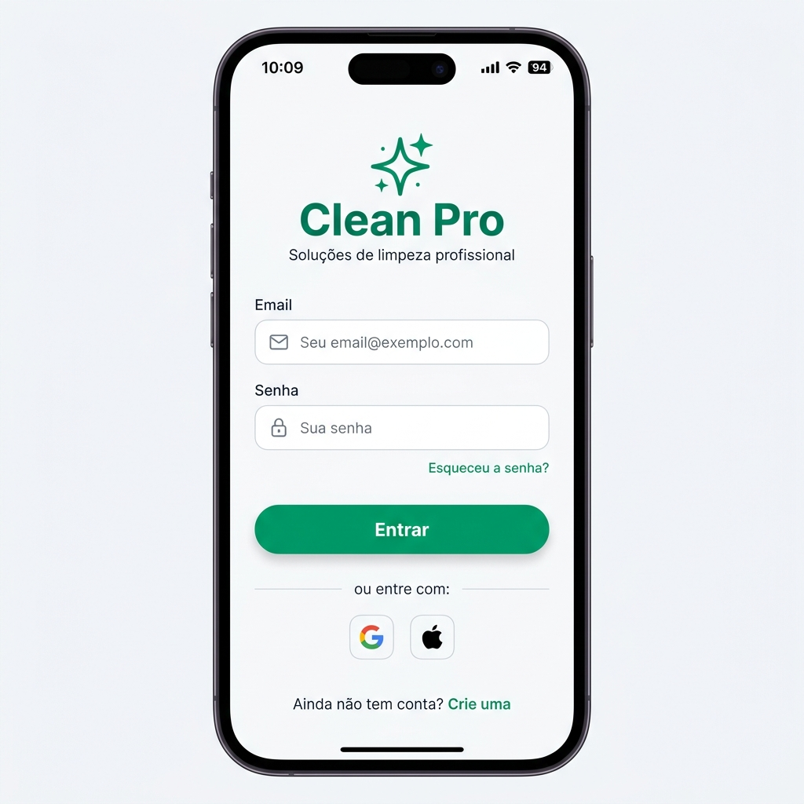
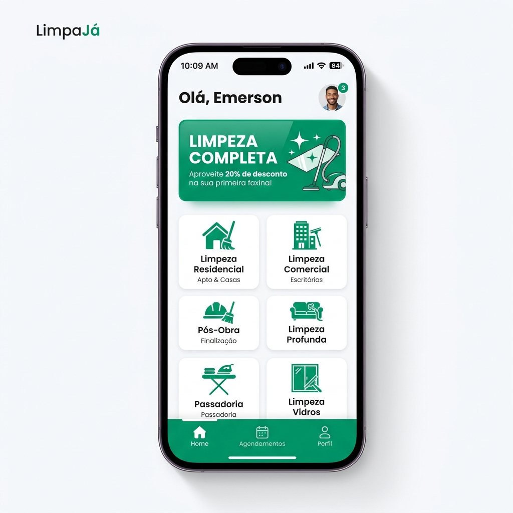
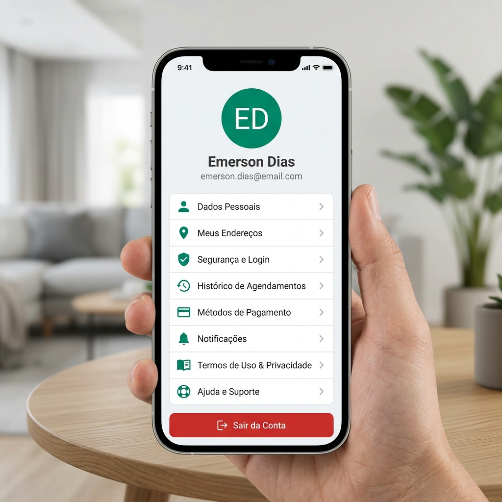

# Clean Pro Solutions - Mobile App 📱

A aplicação mobile da plataforma **Clean Pro Solutions** foi desenvolvida para conectar clientes a profissionais de limpeza de forma eficiente, segura e com uma experiência de usuário premium.

## ✨ Características Principais

- **Design Premium**: Interface moderna com tema Esmeralda, focada em "limpeza" visual e usabilidade.
- **Arquitetura Escalável**: Desenvolvido com React Native, Expo Router e Axios.
- **Integração BFF**: Todas as operações são centralizadas através do Backend for Frontend (BFF) para garantir performance e segurança.
- **Gestão de Sessão**: Autenticação robusta com JWT e refresh token automático.

---

## 📸 Demonstração das Telas

````carousel

**Acesso Seguro**: Interface de login simplificada com validação em tempo real e integração com o serviço de autenticação via BFF.
<!-- slide -->

**Dashboard Inteligente**: Visão geral de serviços disponíveis, banners promocionais e acesso rápido às principais funcionalidades.
<!-- slide -->

**Gestão de Serviços**: Acompanhamento detalhado de todos os agendamentos com status visual (Pendente, Em Andamento, Concluído).
<!-- slide -->

**Área do Usuário**: Controle total sobre dados pessoais, endereços, segurança e preferências do aplicativo.
````

---

## 🚀 Tecnologias Utilizadas

- **Framework**: [Expo](https://expo.dev/) (React Native)
- **Roteamento**: [Expo Router](https://docs.expo.dev/router/introduction/) (File-based routing)
- **Estilização**: StyleSheet (Vanilla CSS-in-JS)
- **API Client**: [Axios](https://axios-http.com/) com Interceptors
- **Icons**: [Ionicons](https://ionicons.com/)
- **Storage**: [AsyncStorage](https://react-native-async-storage.github.io/async-storage/)

---

## 🛠️ Como Executar o Projeto

1. **Instalação**:
   Navegue até a pasta `frontend` e instale as dependências:
   ```bash
   npm install
   ```

2. **Configuração**:
   Verifique o arquivo `.env` para garantir que `EXPO_PUBLIC_BACKEND_URL` aponta para o endereço correto do BFF.

3. **Execução**:
   Inicie o servidor de desenvolvimento do Expo:
   ```bash
   npm run start
   ```

---

## 🏗️ Estrutura do Projeto

- `/app`: Rotas e layouts da aplicação (Expo Router).
- `/src/components`: Componentes de interface reutilizáveis.
- `/src/context`: Gerenciamento de estado global (Auth).
- `/src/services`: Configuração do cliente API e interceptors.
- `/src/theme`: Definições de cores, espaçamentos e sombras.
- `/src/hooks`: Lógica de negócio e chamadas de API encapsuladas.

---

Desenvolvido com ❤️ pela equipe Clean Pro Solutions.
