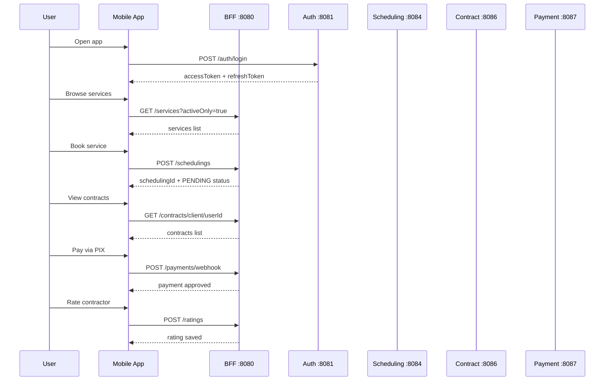

# 📱 Clean Pro Solutions — Mobile App (Frontend)

React Native mobile application for the Clean Pro Solutions platform. Connects clients with professional cleaners via a seamless booking, payment, and communication experience.

---

## 🛠️ Tech Stack

| Technology | Version | Purpose |
|-----------|---------|---------|
| React Native | 0.79.5 | Mobile framework |
| React | 19.0.0 | UI library |
| Expo | 53.0.20 | Build & dev tooling |
| Expo Router | 5.1.4 | File-based navigation |
| TypeScript | 5.8.3 | Type safety |
| AsyncStorage | 2.x | Token persistence |
| Expo Vector Icons | 14.x | Ionicons icon set |

---

## 🗂️ App Architecture

```mermaid
graph TD
    A[index.tsx] --> B{Authenticated?}
    B -->|No| C[/auth/login]
    B -->|Yes| D[/tabs/home]

    C --> E[/auth/register]
    C --> F[/auth/forgot-password]

    D --> G[/tabs/jobs]
    D --> H[/tabs/profile]

    D --> I[/booking]
    D --> J[/contracts]
    D --> K[/payment]
    D --> L[/availability]
    D --> M[/chat]
    D --> N[/notifications]
    D --> O[/review]
    D --> P[/search]
    D --> Q[/map]

    J --> R[/contract-details/id]
    R --> K
    R --> M

    H --> S[/profile/personal-data]
    H --> T[/profile/addresses]
    H --> U[/profile/payments]
    H --> V[/profile/support]
    H --> W[/profile/security]
    H --> X[/profile/settings]
    V --> Y[/ticket-details/id]
```

---

## 📱 Screens — Complete List (30 screens)

### Authentication Flow
| Screen | File | Description |
|--------|------|-------------|
| Login | `app/(auth)/login.tsx` | Email/password login with JWT |
| Register | `app/(auth)/register.tsx` | New account creation (CLIENT/CONTRACTOR) |
| Forgot Password | `app/(auth)/forgot-password.tsx` | Password reset via email |

### Main Tabs
| Screen | File | Description |
|--------|------|-------------|
| Home | `app/(tabs)/home.tsx` | Dashboard: services, search, 8 quick actions |
| Jobs | `app/(tabs)/jobs.tsx` | Scheduling list and management |
| Profile | `app/(tabs)/profile.tsx` | User profile and settings menu |

### Service & Booking Flow
| Screen | File | Description |
|--------|------|-------------|
| Search | `app/search.tsx` | Full-text service search |
| Service Details | `app/service-details/[id].tsx` | Catalog service detail view |
| Booking | `app/booking.tsx` | Create scheduling (single or recurring) |
| Availability | `app/availability.tsx` | Check contractor availability by time slot |
| Contractor Profile | `app/contractor-profile/[id].tsx` | Contractor ratings, bio, specialties |
| Map | `app/map.tsx` | Nearby contractors geospatial map |

### Contract & Payment Flow
| Screen | File | Description |
|--------|------|-------------|
| Contracts | `app/contracts.tsx` | All user contracts with status filter tabs |
| Contract Details | `app/contract-details/[id].tsx` | SAGA status timeline, context-aware actions |
| Payment | `app/payment.tsx` | PIX / Cartão / Boleto payment processing |
| Job Details | `app/job-details/[id].tsx` | Scheduling detail with cancel/complete |

### Communication
| Screen | File | Description |
|--------|------|-------------|
| Chat | `app/chat.tsx` | Real-time messaging (SSE) per contract room |
| Notifications | `app/notifications.tsx` | Push & in-app notifications list |

### Post-Service
| Screen | File | Description |
|--------|------|-------------|
| Review | `app/review.tsx` | 5-star rating + comment submission |

### Profile & Settings
| Screen | File | Description |
|--------|------|-------------|
| Personal Data | `app/profile/personal-data.tsx` | Edit name, phone, email |
| Addresses | `app/profile/addresses.tsx` | Saved addresses management |
| Payments | `app/profile/payments.tsx` | Saved payment methods |
| Security | `app/profile/security.tsx` | Change password, 2FA |
| Settings | `app/profile/settings.tsx` | Notifications, language, theme |
| Support | `app/profile/support.tsx` | Create & list support tickets |
| Ticket Details | `app/ticket-details/[id].tsx` | Ticket detail with resolution info |

---

## 🔄 E2E User Flow



---

## 🚀 Getting Started

### Prerequisites
- Node.js 18+
- Yarn 1.22+
- Expo CLI: `npm install -g @expo/cli`
- iOS Simulator (Mac) or Android Emulator, or Expo Go app

### Install & Run

```bash
cd clean-pro-solutions-app/frontend
yarn install
yarn start
```

Then:
- Press `a` for Android emulator
- Press `i` for iOS simulator
- Press `w` for Web browser
- Scan QR code with **Expo Go** app on your device

### Connect to Real Backend

In `src/services/api.ts`, set:
```typescript
const USE_MOCKS = false;                      // disable mock mode
const API_BASE_URL = 'http://localhost:8080'; // BFF gateway address
```

Start the full platform:
```bash
# From project root
docker-compose up -d --build
```

Wait for Eureka dashboard to show all services: http://localhost:8761

---

## 🎨 Design System

### Color Palette
| Token | Hex | Usage |
|-------|-----|-------|
| `primary` | `#059669` | Buttons, highlights, confirmed states |
| `primaryLight` | `#34d399` | Hover, badges |
| `secondary` | `#3B82F6` | Info, links |
| `background` | `#F9FAFB` | Screen backgrounds |
| `surface` | `#FFFFFF` | Cards, inputs |
| `error` | `#EF4444` | Error, destructive actions |
| `warning` | `#F59E0B` | Pending states |
| `success` | `#10B981` | Confirmed, approved |

### Reusable Components
| Component | Props |
|-----------|-------|
| `Button` | `variant` (primary/secondary/outline/danger), `size` (sm/md/lg), `loading` |
| `Card` | `variant` (elevated/outlined/flat), `style` |
| `Input` | `label`, `icon`, `error`, `secureTextEntry` |

---

## 📂 Project Structure

```
frontend/
├── app/                          # Expo Router file-based routing
│   ├── _layout.tsx               # Root layout (AuthProvider + SafeAreaProvider)
│   ├── index.tsx                 # Auth guard redirect
│   ├── (auth)/                   # Authentication screens
│   │   ├── login.tsx
│   │   ├── register.tsx
│   │   └── forgot-password.tsx
│   ├── (tabs)/                   # Bottom tab navigation
│   │   ├── home.tsx              # Dashboard + quick actions
│   │   ├── jobs.tsx              # Scheduling list
│   │   └── profile.tsx           # User profile menu
│   ├── availability.tsx          # Contractor availability checker
│   ├── booking.tsx               # Create single/recurring scheduling
│   ├── chat.tsx                  # Real-time chat (SSE)
│   ├── contracts.tsx             # Contract list with status filters
│   ├── contract-details/[id].tsx # Contract detail + SAGA timeline
│   ├── notifications.tsx         # Notifications center
│   ├── payment.tsx               # PIX / Cartão / Boleto payment
│   ├── review.tsx                # 5-star contractor rating
│   ├── search.tsx                # Catalog full-text search
│   ├── map.tsx                   # Geospatial contractor map
│   ├── contractor-profile/[id].tsx
│   ├── job-details/[id].tsx
│   ├── service-details/[id].tsx
│   ├── ticket-details/[id].tsx
│   └── profile/
│       ├── addresses.tsx
│       ├── payments.tsx
│       ├── personal-data.tsx
│       ├── security.tsx
│       ├── settings.tsx
│       └── support.tsx
├── src/
│   ├── components/               # Reusable UI components
│   │   ├── Button.tsx
│   │   ├── Card.tsx
│   │   └── Input.tsx
│   ├── context/
│   │   └── AuthContext.tsx       # Global auth state + JWT persistence
│   ├── hooks/
│   │   └── useHomeData.ts
│   ├── services/
│   │   ├── api.ts                # HTTP client (USE_MOCKS toggle)
│   │   └── mockData.ts           # Development mock data
│   └── theme/
│       └── theme.ts              # Design tokens (colors, spacing, shadows)
└── package.json
```

---

© 2026 Clean Pro Solutions — Developed by Emerson Lima
